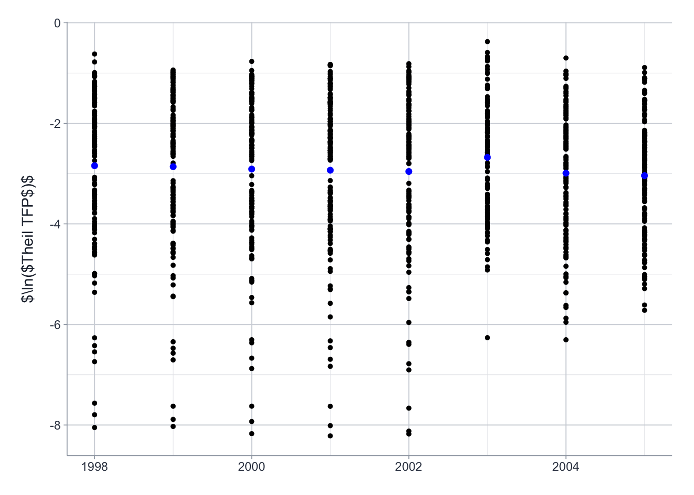
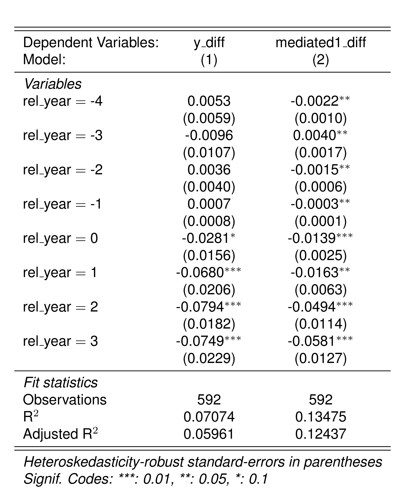
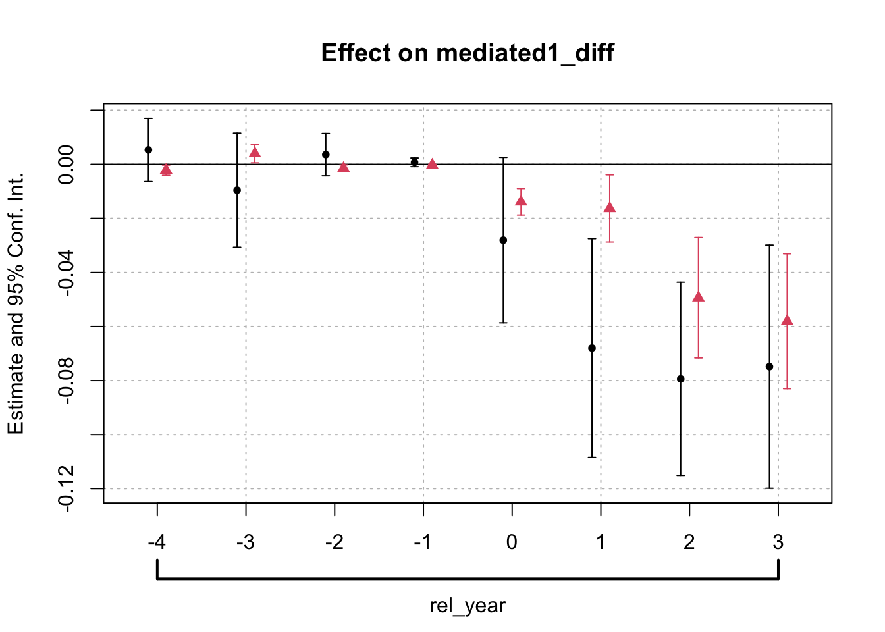
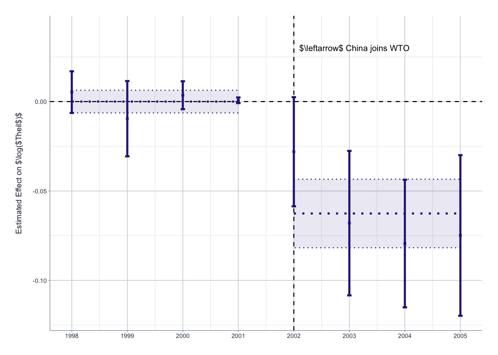
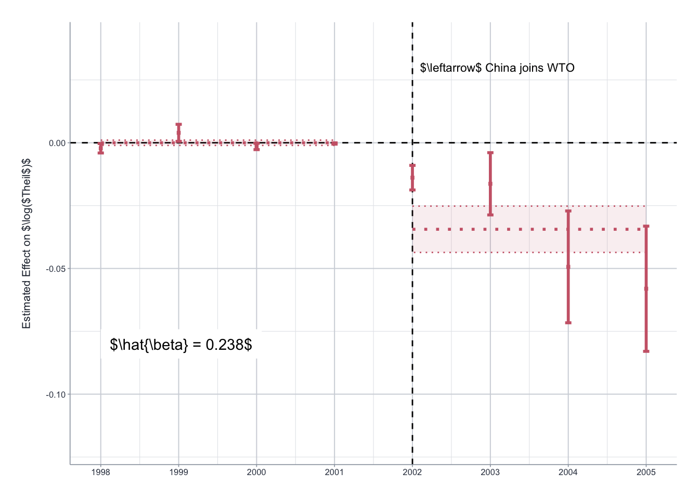
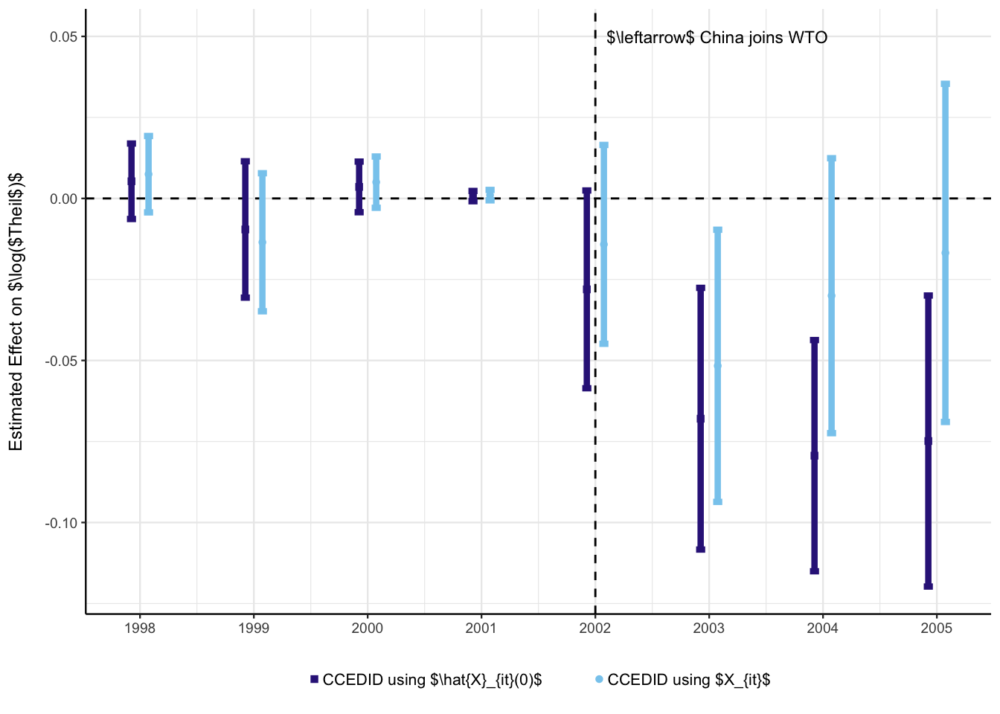

# Interpolating 2003 data


The data in 2003 is likely incorrect Chen, W. and Chen, X. and Hsieh,
C.-T. and Song, Z.: ‘A forensic examination of China’s national
accounts’

So to help with this, we reanalyzed the data interpolating values for
2003

``` r
library(data.table)
library(here)
library(did2s)
library(ggplot2)
library(kfbmisc)
library(fixest)
setFixest_etable(markdown = TRUE)

# https://stats.stackexchange.com/questions/118033/best-series-of-colors-to-use-for-differentiating-series-in-publication-quality
colors <- c("#332288", "#88CCEE", "#44AA99", "#117733", "#999933", "#DDCC77", "#CC6677", "#882255", "#AA4499")
```

## Load and clean data

``` r
df <- haven::read_dta(here("code/Trade-Liberalization-and-Markup-Dispersion/data/AEJ_ind_DID_3-digit.dta"))
setDT(df)

# construct key variables
df[year == 2001, a01 := avgtariff_ind3 / 100]
df[, tariff01 := mean(a01[year == 2001]), by = "sic3"]
df[, post02 := (year > 2001)]
df[, t01post02 := tariff01 * post02]

median_tariff01 <- df[
  year == 2001, 
  quantile(tariff01, probs = 0.5, na.rm = TRUE)
]
df[,
  hightariff := (tariff01[year == 2001] >= median_tariff01),
  by = "sic3"
]
df[, hightariff_post02 := hightariff & post02]
df[, rel_year := ifelse(hightariff, year - 2002, -Inf)]
df[, rel_year_post := ifelse(rel_year >= 1, 1, rel_year)]

df[, ln_gini := log(gini)]
df[, ln_theil := log(theil)]
df[, ln_cv := log(cv)]
df[, ln_mld := log(mld)]
df[, ln_rmd := log(rmd)]

df[, lnn := log(n)]
df[, lnasset := log(assets)]
df[, lnexports := log(exports)]
df[, lnfdi := log(foreign)]
df[, lnit := log(input_tariff)]
df[, tariff := avgtariff_ind3 / 100]

df <- df[!is.na(hightariff), ]

df[, pre_post := fcase(
  rel_year > -Inf & rel_year < 0, "pre",
  rel_year >= 0, "post",
  default = "control"
)]
```

## CCE DID

``` r
setorder(df, sic3, year)
setDT(df)
df$y <- df$ln_theil
df$x1 <- df$ln_theil_tfp

xvars <- c("x1")
df <- df[!(is.na(y) | is.na(x1)), ]

# Balanced panel
df[, n := .N, by = "sic3"]
df <- df[n == 8, ]

T0 <- 2001
df[, g := ifelse(hightariff == TRUE, 2002, Inf)]
```

``` r
collapse = df[, 
  .(
    mean_ln_theil_tfp = mean(ln_theil_tfp, na.rm = TRUE), 
    sd_ln_theil_tfp = sd(ln_theil_tfp, na.rm = TRUE)
  ), 
  by = year
]

(plot_ln_theil_tfp <- ggplot() +
  geom_point(
    aes(x = year, y = ln_theil_tfp),
    data = df,
    size = 1.1
  ) + 
  geom_point(
    aes(x = year, y = mean_ln_theil_tfp),
    data = collapse,
    color = "blue",
    size = 2, shape = 16
  ) + 
  labs(x = NULL, y = r'($\ln($Theil TFP$)$)') + 
  kfbmisc::theme_kyle(base_size = 10))
```



Linearly Interpolate 2002 and 2004:

``` r
df[, 
  x1 := 
    ifelse(year == 2003, (x1[year == 2002] + x1[year == 2004])/2, x1), 
  by = "sic3"
]
```

### CCE pooled estimate of hat

``` r
# CSAs of y and Xs
Fhat <- df |>
  setDT() |> 
  _[
    g == Inf,
    lapply(.SD, \(x) mean(x)),
    by = year,
    .SDcols = c("y", xvars)
  ] |>
  _[,
    as.matrix(.SD),
    .SDcols = c("y", xvars)
  ]

# Add constant to Fhat
Fhat = cbind(Fhat, rep(1, nrow(Fhat)))

# CCEP estimator for \hat{\beta} using pre-treatment X's for all groups
N_pre_T0 <- (T0 - min(df$year) + 1)
Fpre <- Fhat[1:N_pre_T0, ]
M_Fpre <- diag(N_pre_T0) - Fpre %*% solve(t(Fpre) %*% Fpre) %*% t(Fpre)

B <- matrix(0, nrow = length(xvars), ncol = length(xvars))
A <- matrix(0, nrow = length(xvars), ncol = 1)

for (id in unique(df[, sic3])) {
  Xi_pre <- df |>
    _[
      sic3 == id & year <= T0,
      as.matrix(.SD),
      .SDcols = xvars
    ]

  yi_pre <- df[
    sic3 == id & year <= T0,
    y
  ]

  B <- B + t(Xi_pre) %*% M_Fpre %*% Xi_pre
  A <- A + t(Xi_pre) %*% M_Fpre %*% yi_pre
}

bhat <- solve(B) %*% A
```

### Imputation of covariates and outcome

``` r
for (sic3_id in unique(df[g < Inf, sic3])) {

  idx = df$sic3 == sic3_id

  # impute factor loadings
  Xi_pre <- df[idx, ] |>
    _[
      year <= T0,
      as.matrix(.SD),
      .SDcols = xvars
    ]

  yi_pre <- df[idx, ][year <= T0, y]

  ghats <- solve(t(Fpre) %*% Fpre) %*% t(Fpre) %*% (yi_pre - Xi_pre %*% bhat)

  # impute X(0)
  X_0hat <- Fhat %*% solve(t(Fpre) %*% Fpre) %*% t(Fpre) %*% Xi_pre

  for (i in 1:length(xvars)) {
    var_name <- paste0(xvars[i], "_0hat")
    df[idx, var_name] = X_0hat[, i]
  }

  # impute y(0) using X(0)
  y_0hat <- (X_0hat %*% bhat) + (Fhat %*% ghats)

  df[idx, "y_0hat"] = y_0hat

  # impute y(0) using observed X
  Xi <- df[idx, as.matrix(.SD), .SDcols = xvars]

  y_0hat_obs_x <- (Xi %*% bhat) + (Fhat %*% ghats)

  df[idx, "y_0hat_obs_x"] = y_0hat_obs_x
}
```

Difference variables: Z\_{it} - \_{it}(0):

``` r
df$y_diff <- df$y - df$y_0hat
df$y_diff_obs_x <- df$y - df$y_0hat_obs_x
df$x1_diff <- (df$x1 - df$x1_0hat)
df$mediated1_diff <- df$x1_diff * bhat[1]
df$x2_diff <- (df$x2 - df$x2_0hat)
df$mediated2_diff <- df$x2_diff * bhat[2]
```

### Estimate Effects

``` r
# Log(theil)
est_ln_theil_cce <- feols(
  y_diff ~ 0 + i(rel_year),
  df[g < Inf, ],
  vcov = "hc1"
)

est_ln_theil_pre_post <- feols(
  y_diff ~ 0 + i(pre_post),
  df[g < Inf, ],
  vcov = "hc1"
)

est_ln_theil_cce_obs_x <- feols(
  y_diff_obs_x ~ 0 + i(rel_year),
  df[g < Inf, ],
  vcov = "hc1"
)

# [X_{1it} - X_{1it}(0)] * \beta_1
est_x1_cce <- feols(
  mediated1_diff ~ 0 + i(rel_year),
  df[g < Inf, ],
  vcov = "hc1"
)

est_x1_pre_post <- feols(
  mediated1_diff ~ 0 + i(pre_post),
  df[g < Inf, ],
  vcov = "hc1"
)
```

``` r
feols(
  y_diff ~ 0 + i(rel_year), 
  df[g < Inf, ],
  vcov = "hc1"
) |>
  summary()
```

    OLS estimation, Dep. Var.: y_diff
    Observations: 592
    Standard-errors: Heteroskedasticity-robust 
                  Estimate Std. Error   t value   Pr(>|t|)    
    rel_year::-4  0.005297   0.005939  0.891862 3.7283e-01    
    rel_year::-3 -0.009575   0.010736 -0.891862 3.7283e-01    
    rel_year::-2  0.003556   0.003987  0.891862 3.7283e-01    
    rel_year::-1  0.000721   0.000809  0.891862 3.7283e-01    
    rel_year::0  -0.028059   0.015569 -1.802245 7.2022e-02 .  
    rel_year::1  -0.067973   0.020600 -3.299580 1.0273e-03 ** 
    rel_year::2  -0.079376   0.018199 -4.361469 1.5273e-05 ***
    rel_year::3  -0.074862   0.022908 -3.267889 1.1471e-03 ** 
    ---
    Signif. codes:  0 '***' 0.001 '**' 0.01 '*' 0.05 '.' 0.1 ' ' 1
    RMSE: 0.124177   Adj. R2: 0.059606

``` r
feols(
  y_diff ~ 0 + i(rel_year), 
  df[g < Inf, ]
) |>
  summary()
```

    OLS estimation, Dep. Var.: y_diff
    Observations: 592
    Standard-errors: IID 
                  Estimate Std. Error   t value   Pr(>|t|)    
    rel_year::-4  0.005297   0.014534  0.364468 7.1564e-01    
    rel_year::-3 -0.009575   0.014534 -0.658784 5.1029e-01    
    rel_year::-2  0.003556   0.014534  0.244678 8.0679e-01    
    rel_year::-1  0.000721   0.014534  0.049638 9.6043e-01    
    rel_year::0  -0.028059   0.014534 -1.930601 5.4016e-02 .  
    rel_year::1  -0.067973   0.014534 -4.676876 3.6220e-06 ***
    rel_year::2  -0.079376   0.014534 -5.461448 6.9958e-08 ***
    rel_year::3  -0.074862   0.014534 -5.150862 3.5508e-07 ***
    ---
    Signif. codes:  0 '***' 0.001 '**' 0.01 '*' 0.05 '.' 0.1 ' ' 1
    RMSE: 0.124177   Adj. R2: 0.059606

``` r
est_y_post <- feols(
  y_diff ~ 0 + i(rel_year), 
  df[g < Inf, ],
  vcov = "hc1"
) 
est_x1_post <- feols(
  mediated1_diff ~ 0 + i(rel_year), 
  df[g < Inf, ], 
  vcov = "hc1"
) 
```

``` r
esttable(list(est_y_post, est_x1_post))
```

    <div class = "etable"></div>

``` r
coefplot(list(est_y_post, est_x1_post))
```



``` r
esttable(list(est_ln_theil_cce, est_x1_cce))
```

    <div class = "etable"></div>

## Plot Results

### Graph: CCEDID

``` r
ests <- broom::tidy(est_ln_theil_cce)
setDT(ests)
ests$rel_year <- stringr::str_replace(ests$term, "rel_year::", "") |>
  as.numeric()

ests_pre_post <- broom::tidy(est_ln_theil_pre_post)
setDT(ests_pre_post)
ests_pre_post[, 
  pre_post := stringr::str_replace(term, "pre_post::", "")
]

ests_pre_post = rbindlist(list(
  ests_pre_post[pre_post == "pre", ],
  ests_pre_post[pre_post == "pre", ],
  ests_pre_post[pre_post == "post", ],
  ests_pre_post[pre_post == "post", ]
))
ests_pre_post$x = c(-4, -1, 0, 3)
```

``` r
(p <- ggplot() +
  geom_hline(yintercept = 0, linetype = "dashed") +
  geom_vline(xintercept = 2002, linetype = "dashed") +
  annotate(
    "text",
    x = 2002.1, y = 0.03, hjust = 0,
    label = r'($\leftarrow$ China joins WTO)', size = 3
  ) +
  geom_errorbar(
    data = ests,
    aes(
      x = rel_year + 2002,
      ymin = estimate - 1.96 * std.error, ymax = estimate + 1.96 * std.error
    ),
    color = colors[1],
    # Change to 1 for pdf version
    linewidth = 1,
    width = 0.08
  ) +
  geom_point(
    data = ests,
    aes(
      x = rel_year + 2002, y = estimate
    ),
    size = 1, 
    color = colors[1], shape = 15
  ) +
  geom_ribbon(
    data = ests_pre_post,
    aes(
      x = x + 2002,
      ymin = estimate - 1.96 * std.error, 
      ymax = estimate + 1.96 * std.error, 
      group = pre_post
    ),
    fill = colors[1],
    alpha = 0.1,
    color = colors[1],
    linetype = "dotted",
  ) + 
  geom_line(
    data = ests_pre_post,
    aes(
      x = x + 2002,
      y = estimate,
      group = pre_post
    ),
    color = colors[1],
    linewidth = 1,
    linetype = "dotted"
  ) + 
  scale_y_continuous(limits = c(-0.12, 0.04)) + 
  scale_x_continuous(breaks = 2002 + -4:3) +
  labs(x = NULL, y = r'(Estimated Effect on $\log($Theil$)$)') +
  kfbmisc::theme_kyle(base_size = 7) +
  theme(
    panel.border = element_blank(),
    axis.line = element_line(),
    legend.position = "bottom",
    legend.title = element_text(size = 10),
    legend.background = element_rect(fill = "white"),
    legend.spacing.x = unit(0.1, "cm"),
    legend.key.width = unit(1, "cm"),
    legend.text = element_text(size = 8, margin = margin(t = 0, r = 10, b = 0, l = -10)),
    axis.title.x = element_text(margin = margin(t = 10, r = 0, b = 0, l = 0)),
    axis.title.y = element_text(margin = margin(t = 0, r = 10, b = 0, l = 0))
  ))
```



``` r
kfbmisc::tikzsave(
  here("figures/trade-cce_est_interpolated.pdf"), 
  p, width = 5.5, height = 2.5
)
```

### Graph: X1 Mediated

``` r
ests <- broom::tidy(est_x1_cce)
setDT(ests)
ests$rel_year <- stringr::str_replace(ests$term, "rel_year::", "") |>
  as.numeric()

ests_pre_post <- broom::tidy(est_x1_pre_post)
setDT(ests_pre_post)
ests_pre_post[, 
  pre_post := stringr::str_replace(term, "pre_post::", "")
]

ests_pre_post = rbindlist(list(
  ests_pre_post[pre_post == "pre", ],
  ests_pre_post[pre_post == "pre", ],
  ests_pre_post[pre_post == "post", ],
  ests_pre_post[pre_post == "post", ]
))
ests_pre_post$x = c(-4, -1, 0, 3)
```

``` r
(p <- ggplot() +
  geom_hline(yintercept = 0, linetype = "dashed") +
  geom_vline(xintercept = 2002, linetype = "dashed") +
  annotate(
    "text",
    x = 2002.1, y = 0.03, hjust = 0,
    label = r'($\leftarrow$ China joins WTO)', size = 3
  ) +
  annotate(
    geom = "label", x = 1998, y = -0.08, 
    label = r'($\hat{\beta} = 0.238$)',
    bg = "white", hjust = 0,
    label.padding = unit(0.5, "lines"),
    label.r = unit(0, "lines"),
    label.size = 0
  ) + 
  geom_errorbar(
    data = ests,
    aes(
      x = rel_year + 2002,
      ymin = estimate - 1.96 * std.error, ymax = estimate + 1.96 * std.error
    ),
    color = colors[7],
    # Change to 1 for pdf version
    linewidth = 1,
    width = 0.08
  ) +
  geom_point(
    data = ests,
    aes(
      x = rel_year + 2002, y = estimate
    ),
    size = 1, 
    color = colors[7], shape = 15
  ) +
  geom_ribbon(
    data = ests_pre_post,
    aes(
      x = x + 2002,
      ymin = estimate - 1.96 * std.error, 
      ymax = estimate + 1.96 * std.error, 
      group = pre_post
    ),
    fill = colors[7],
    alpha = 0.1,
    color = colors[7],
    linetype = "dotted",
  ) + 
  geom_line(
    data = ests_pre_post,
    aes(
      x = x + 2002,
      y = estimate,
      group = pre_post
    ),
    color = colors[7],
    linewidth = 1,
    linetype = "dotted"
  ) + 
  scale_y_continuous(limits = c(-0.12, 0.04)) + 
  scale_x_continuous(breaks = 2002 + -4:3) +
  labs(x = NULL, y = r'(Estimated Effect on $\log($Theil$)$)') +
  kfbmisc::theme_kyle(base_size = 7) +
  theme(
    panel.border = element_blank(),
    axis.line = element_line(),
    legend.position = "bottom",
    legend.title = element_text(size = 10),
    legend.background = element_rect(fill = "white"),
    legend.spacing.x = unit(0.1, "cm"),
    legend.key.width = unit(1, "cm"),
    legend.text = element_text(size = 8, margin = margin(t = 0, r = 10, b = 0, l = -10)),
    axis.title.x = element_text(margin = margin(t = 10, r = 0, b = 0, l = 0)),
    axis.title.y = element_text(margin = margin(t = 0, r = 10, b = 0, l = 0))
  ))
```



``` r
kfbmisc::tikzsave(
  here("figures/trade-cce_mediated_est_interpolated.pdf"),
  p, width = 5.5, height = 2.5
)
```

### Graph: Using observed X vs. X(0)

``` r
est1 <- broom::tidy(est_ln_theil_cce)
est1$estimator <- r'(CCEDID using $\hat{X}_{it}(0)$)'
est1$estimator_num <- 1
est2 <- broom::tidy(est_ln_theil_cce_obs_x)
est2$estimator <- r'(CCEDID using $X_{it}$)'
est2$estimator_num <- 2

ests <- rbindlist(list(est1, est2))
ests$rel_year <- stringr::str_replace(ests$term, "rel_year::", "") |>
  as.numeric()

ests[, rel_year := data.table::fcase(
  estimator_num == 1, rel_year - 0.075,
  estimator_num == 2, rel_year + 0.075
)]
ests$estimator <- forcats::as_factor(ests$estimator)
```

``` r
(p <- ggplot() +
  geom_hline(yintercept = 0, linetype = "dashed") +
  geom_vline(xintercept = 2002, linetype = "dashed") +
  annotate(
    "text",
    x = 2002.1, y = 0.05, hjust = 0,
    label = r'($\leftarrow$ China joins WTO)', size = 3
  ) +
  geom_errorbar(
    data = ests,
    aes(
      x = rel_year + 2002,
      ymin = estimate - 1.96 * std.error, ymax = estimate + 1.96 * std.error,
      color = estimator
    ),
    # Change to 1 for pdf version
    linewidth = 1.5,
    width = 0.08
  ) +
  geom_point(
    data = ests,
    aes(
      x = rel_year + 2002, y = estimate,
      color = estimator, shape = estimator
    ),
    size = 1.5
  ) +
  scale_x_continuous(breaks = 2002 + -4:3) +
  scale_color_manual(values = c(colors[1], colors[2])) +
  scale_shape_manual(values = c(15, 16)) +
  labs(x = NULL, y = r'(Estimated Effect on $\log($Theil$)$)', color = NULL, shape = NULL) +
  guides(color = guide_legend(
    # label.position = "bottom",
    override.aes = list(linetype = 0)
  )) +
  theme_bw(base_size = 9) +
  theme(
    panel.border = element_blank(),
    axis.line = element_line(),
    legend.position = "bottom",
    legend.title = element_text(size = 10),
    legend.background = element_rect(fill = "white"),
    legend.spacing.x = unit(0.1, "cm"),
    legend.key.width = unit(1, "cm"),
    legend.text = element_text(size = 8, margin = margin(t = 0, r = 10, b = 0, l = -10)),
    axis.title.x = element_text(margin = margin(t = 10, r = 0, b = 0, l = 0)),
    axis.title.y = element_text(margin = margin(t = 0, r = 10, b = 0, l = 0))
  ))
```



``` r
kfbmisc::tikzsave(
  here("figures/trade-x0-vs-obs-x_interpolated.pdf"), 
  p, , width = 5.5, height = 2.5
)
```
